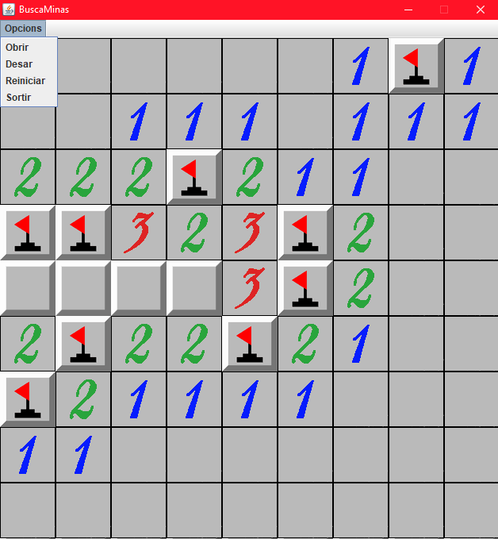
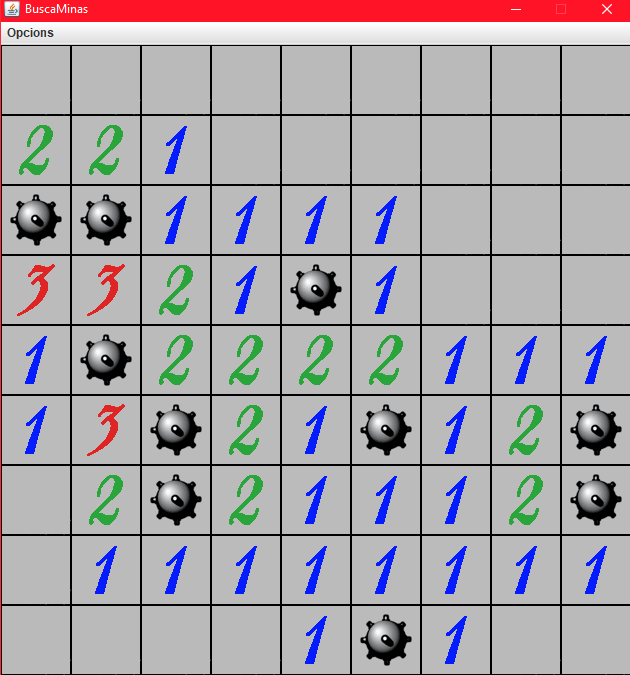

# Minesweeper
Minesweeper game made in Java

## Instructions
There are a total of 10 bombs

- Left mouse button click to reveal a square
- Right mouse button click to flag a square

# Menu options

``1.Obrir``
Allows you to open a saved game

``2.Desar``
Save your current game

``3.Reiniciar``
Set the board to its initial state

``4.Sortir``
Halts the execution of the game

## When you win the game all positions of the bombs will be revealed

